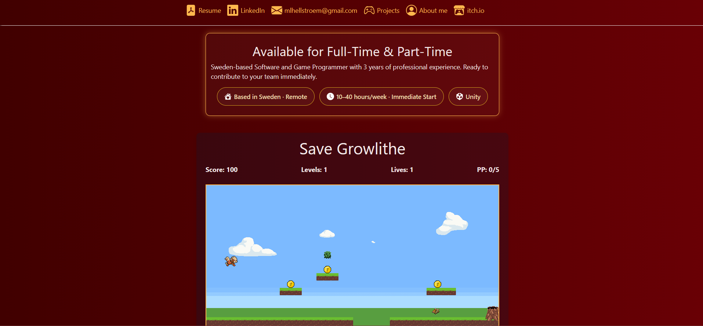
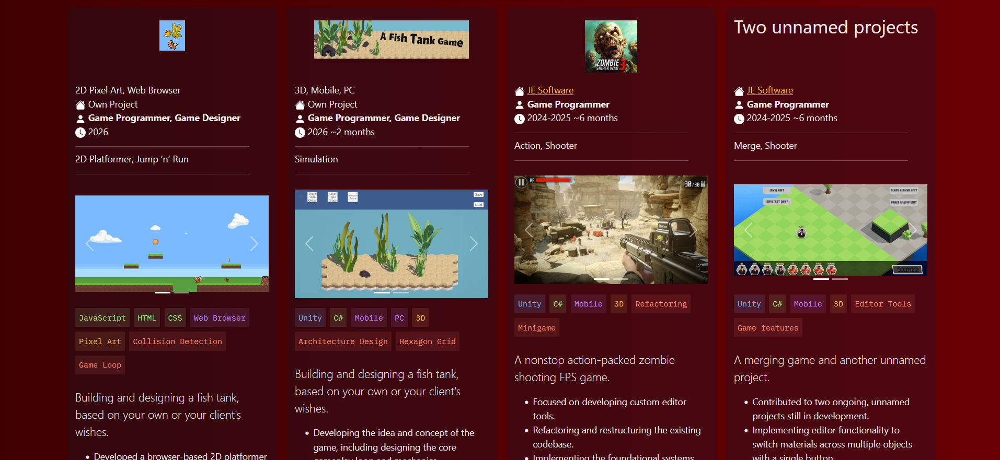

# Marie Hellström — Game Programmer Portfolio 🎮

Personal portfolio showcasing my work as a **Game Programmer**, with a focus on gameplay systems, programming, tools, and software architecture.

### Portfolio Preview

<p>
<a href="https://tktsunamimh.github.io/">
  
</a>
<a href="https://tktsunamimh.github.io/#projects">
  
</a>
</P>

<p align="center">
  <strong>
    <a href="https://tktsunamimh.github.io/">→ View the Live Portfolio ←</a>
  </strong>
</p>

## 👋 About

I'm a Game Programmer with a background in **C# and Unity**, currently expanding my skills toward broader **Software Development**.

Game development has given me experience with many areas that translate directly into software engineering — from designing and implementing systems to debugging, refactoring existing codebases, creating tools, and working with larger projects.

This portfolio brings together both my professional and personal projects and documents the technical challenges I've worked on along the way.

## 💻 What you'll find here

My projects cover areas such as:

* Gameplay and system programming
* C# and Unity development
* Software architecture
* Refactoring and codebase restructuring
* Custom editor and development tools
* Game AI and gameplay logic
* Data and save systems
* JavaScript browser game development
* UI and interactive systems

## 🛠️ Portfolio Tech Stack

The portfolio itself is built with:

* **HTML5**
* **CSS3**
* **JavaScript**
* **Bootstrap**
* **GitHub Pages**

No frontend framework or build system is required.

## 🎮 Selected Work

The portfolio includes both professional and personal work, ranging from commercial Unity projects to smaller experimental projects.

Examples include work involving:

**Unity / C#**

* Gameplay systems
* Custom editor tools
* Codebase refactoring
* Architecture and system design
* Mobile and PC development

**JavaScript**

* Custom game loop
* Player and enemy movement
* Collision detection
* Projectile systems
* Game state and level logic

## 🌱 Beyond Game Development

While game programming remains an important part of my background, I'm currently broadening my knowledge toward **Software Development**.

I'm particularly interested in strengthening my understanding of software architecture, maintainable application development, backend technologies, databases, testing, and modern development practices.

My goal is to combine the problem-solving and systems experience I've gained from game development with a broader software engineering skill set.

## 🚀 Running the Portfolio Locally

Clone the repository:

```bash
git clone https://github.com/TKTsunamiMH/TKTsunamiMH.github.io.git
```

Open `index.html` in your browser.

## 🔗 Links

🌐 **Portfolio:** https://tktsunamimh.github.io/

💻 **GitHub:** https://github.com/TKTsunamiMH

---

*Built from scratch as a home for my projects, experiments, and development journey.*
